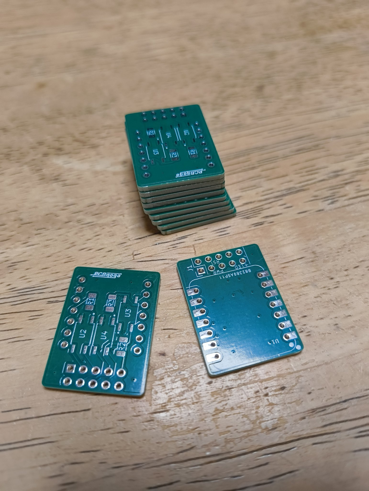
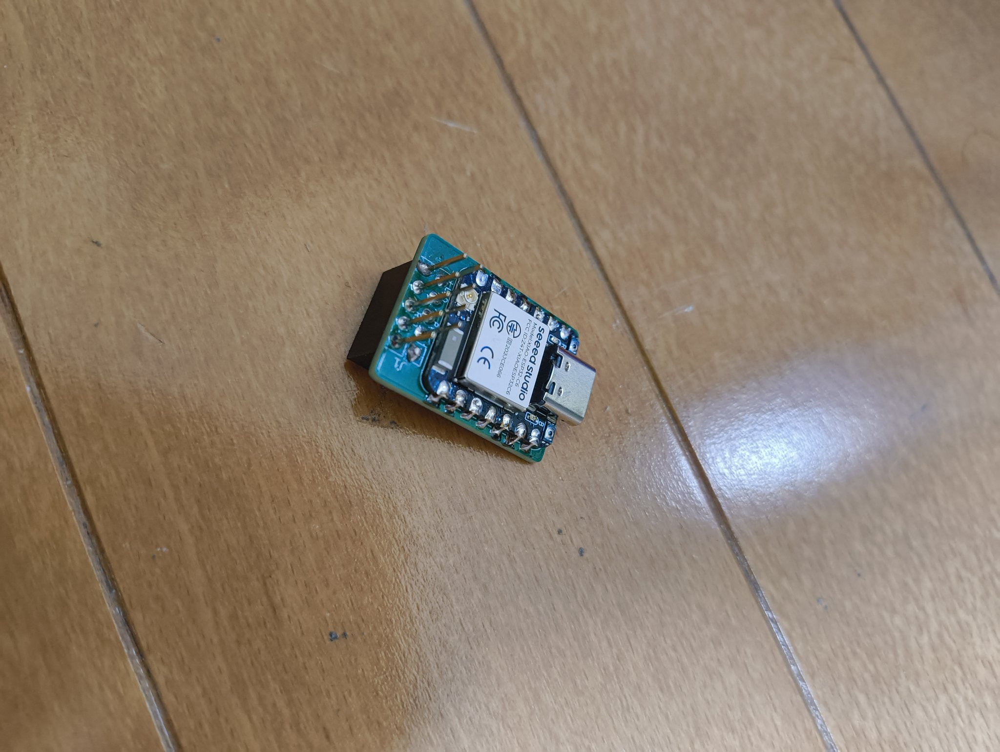
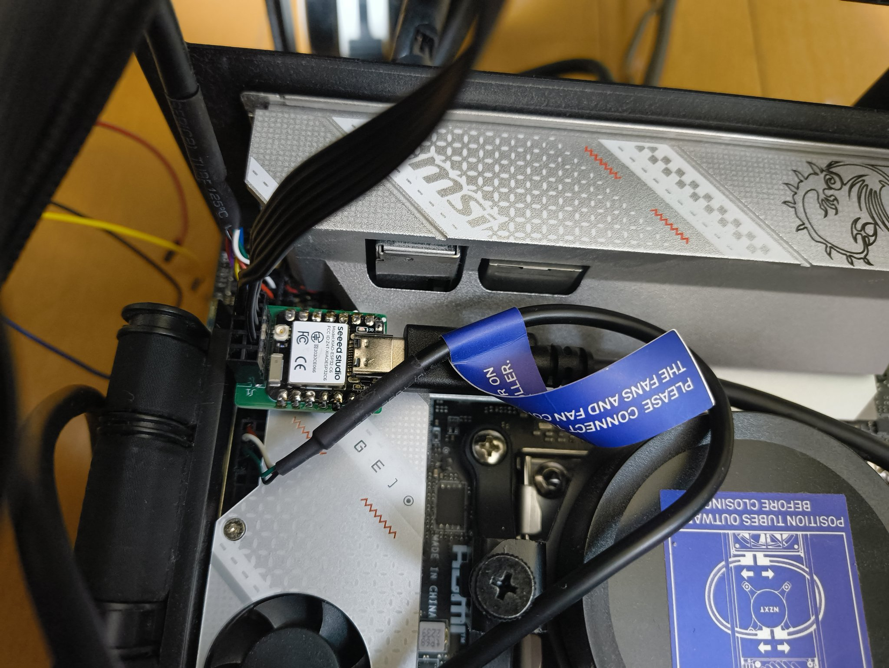

# mini-power

mini power manager for PC

<p>
  
  
</p>
<p>
  
  
</p>

## PCB

### KiCad dependencies

- [TLP172AM](https://www.digikey.jp/ja/models/6679819)
- [SparkFun-Connector](https://github.com/sparkfun/SparkFun-KiCad-Libraries/blob/main/Symbols/SparkFun-Connector.kicad_sym)
- [Seeed Series Kicad files](https://wiki.seeedstudio.com/SeeedStudio_XIAO_Series_Introduction/#seeed-series-kicad-files)

### BOM

- U1: [Seeed Studio XIAO ESP32C6](https://akizukidenshi.com/catalog/g/g129481/) x 1
- U2-U4: [TLP172AM](https://akizukidenshi.com/catalog/g/g116065/) x 3
- J1: [1x5 pin socket](https://akizukidenshi.com/catalog/g/g110397/) x 2
- 1206 SMD resistor
  - R1,R3: 200R x 2
  - R2: 330R x 1
- [PCB](gerber.zip) x 1

## write firmware

```
$ cp src/config.cpp.template src/config.cpp
# Edit src/config.cpp

# install npm packages
$ cd frontend
$ npm install

# build and send firmware using platformio

```
